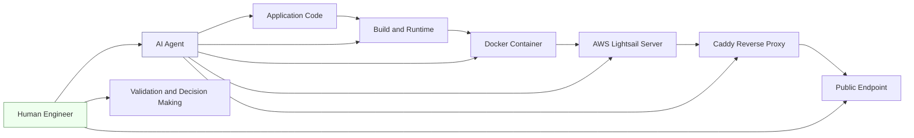
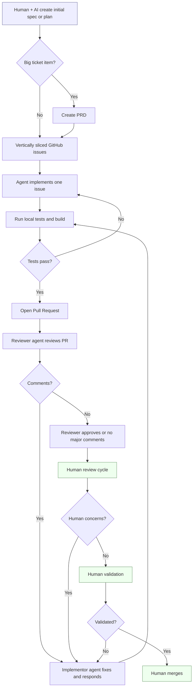
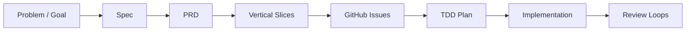
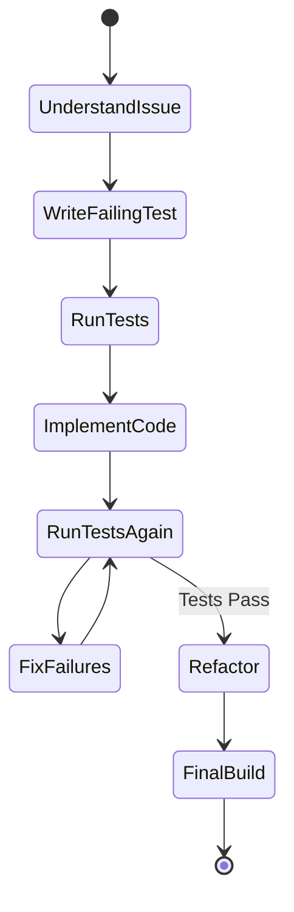
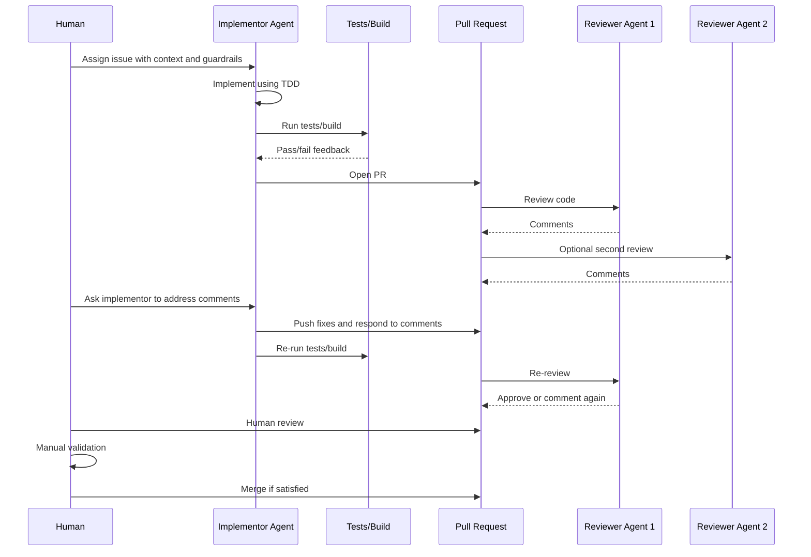
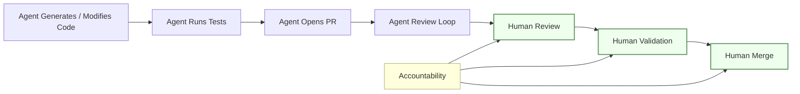
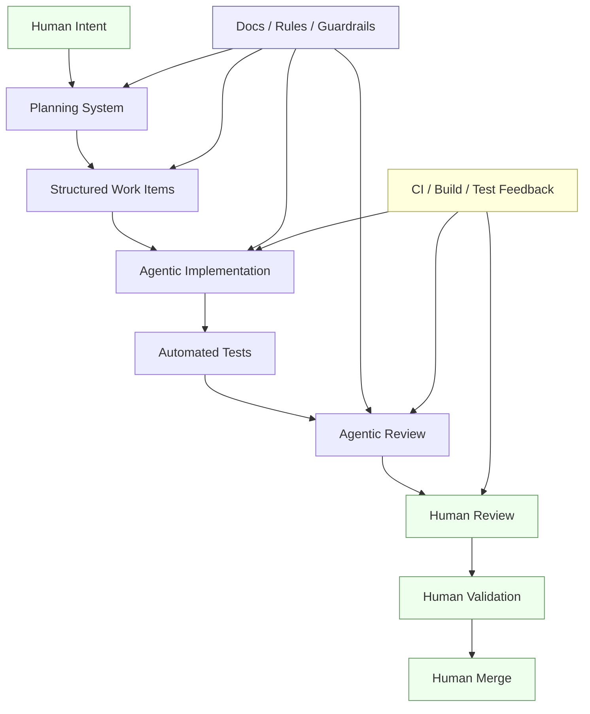

(Below has been crafted with the assistance of Generative AI)

# From AI Coding Assistants to Agentic Engineering: A Hands-on Reflection

Over the last year, my relationship with AI coding tools has changed quite a bit.

In early 2025, I started playing around seriously with agentic coding, primarily through Cursor. At that stage, a lot of it was exploratory. I was using it to move faster, understand code, generate changes, debug issues, and get help inside existing codebases.

Looking back, that phase was necessary for me.

It was not yet a fully disciplined engineering workflow. It was closer to learning by doing. Some people may call that “vibe coding.” For me, it was an important learning phase that helped me understand what these tools were good at, where they struggled, and what kind of human structure they needed around them.

Since then, my thinking has evolved.

I now see agentic coding less as “ask AI to write code” and more as a workflow design problem.

The more structure I put around the agent, the better the outcome.

The more clarity I provide upfront, the less chaos I get downstream.

The more review loops and tests I add, the more confidence I have in the output.

That is why I am starting to think of this not just as agentic coding, but as part of a broader shift toward agentic engineering.

---

## 1. Where I Started: Cursor, Brownfield Code, and Real Systems

My initial experiments were mostly with Cursor, including brownfield backend service development and bug fixing.

The stack included:

* Node.js
* PostgreSQL
* Yarn
* Docker containers
* AWS Lightsail
* Caddy reverse proxy
* A Dart mobile app frontend
* Backend APIs supporting mobile functionality

The interesting part was not just that AI could write code.

The more interesting part was that Cursor could read across related repositories and help reason through how the backend should support functionality that already existed or was expected from the Dart mobile app.

Without getting into product-specific details, this helped with areas like:

* API contracts
* Notification workflows
* Backend behavior needed by the mobile app
* Bug fixing in an existing service
* Build and deployment troubleshooting
* Understanding how pieces connected across repositories

That was one of my first real takeaways:

> AI coding tools become much more useful when they can see enough system context.

A single file is rarely enough.

A single prompt is rarely enough.

The agent needs the surrounding code, documentation, API expectations, and constraints.

---

## 2. From Coding Help to Engineering Help

One of the more eye-opening experiences was when the agent helped reason through infrastructure and deployment, not just application code.

For one brownfield backend service hosted on AWS Lightsail, the work involved understanding deployment flow, Docker containers, the runtime environment, and Caddy reverse proxy configuration.

The agent was able to help reason through the setup after connecting to the server through SSH, inspect the environment, and help think through a deployment plan.

That changed how I looked at these tools.

This was not just:

> “Write this function.”

It was closer to:

> “Understand this system, reason through the constraints, and help me move it forward safely.”

That is when agentic coding starts to blur into agentic engineering.

The human still owns the judgment.

The human still owns the safety boundary.

The human still decides what should be deployed, merged, or trusted.

But the agent can increasingly help with the full engineering surface area: code, tests, docs, build issues, deployment reasoning, and operational troubleshooting.

---

## 3. My Workflow Has Shifted

In the last few months, my workflow has become more structured.

Earlier, I used Cursor mostly as a powerful coding assistant. Now I am experimenting with a more disciplined agentic coding process involving multiple tools and models.

Recently, I have been experimenting with Claude, Codex, and Cursor in different roles.

In one workflow:

* Claude / Opus-class model acted as the implementor
* Codex / GPT-class model acted as a reviewer
* Cursor / Opus-class model acted as another reviewer

In another workflow:

* Codex acted as the implementor
* Cursor acted as the reviewer

I still like Claude a lot as an implementor, partly because of the cowork, dispatch, and remote-control experience on Windows. The ability to keep coding work moving while my laptop is plugged in and running is powerful.

At the same time, Codex has also worked well as an implementor in my experiments.

The bigger lesson is not that one tool is always better.

The bigger lesson is that role separation matters.

One agent implements.

Another reviews.

Another can re-review.

The human remains the architect, quality owner, and final decision maker.

---

## 4. The Remote Coding Moment

One weekend, I had to be out shopping with family.

Part of me wanted to be in front of my laptop playing with all these AI coding tools. But I also had to honor family time.

What felt different this time was that I could still nudge the work forward remotely.

My laptop was plugged in and running at home. Through the remote/dispatch-style workflow, I could send instructions, review progress, and keep the agent moving through small pieces of work.

That included things like:

* New feature work
* Bug fixes
* Documentation
* PR reviews
* PR review fixes
* Re-reviews

That experience made agentic coding feel less like a demo and more like a practical shift in how software work can happen.

Not because we should work every minute.

Not because family time should become work time.

But because software delivery may no longer require the engineer to be physically glued to the IDE for every step of the process.

If the workflow has enough structure, tests, documentation, and review loops, some work can continue asynchronously with human steering.

That is a meaningful change.

---

## 5. My Current End-to-End Agentic Coding Workflow

Here is the workflow I am moving toward.

The important parts are:

* Human + AI collaborate on the plan
* PRD is used for bigger items, not necessarily every small task
* Work is sliced vertically into GitHub issues
* Implementation follows TDD
* Local tests and builds are expected
* PR review is agent-assisted
* Review comments must be fixed and responded to
* Human review still happens
* Human validation still happens
* Human merge is non-negotiable

This is not a “let AI do everything” model.

It is a leverage model.

---

## 6. Front-load the Planning

The biggest lesson so far:

> Front-load the planning. Spend real time there.

When I give vague instructions, the agent may still produce code, but the probability of drift goes up.

When I provide clear specs, acceptance criteria, constraints, repository context, and test expectations, the output gets better.

The agent needs a well-defined box to operate inside.

For larger work, I like the flow of:

The PRD is not always required. For small items, it may be overkill.

But for big-ticket work, forcing the idea through a PRD-like structure helps clarify:

* What problem are we solving?
* Who is it for?
* What is in scope?
* What is out of scope?
* What are the acceptance criteria?
* What are the edge cases?
* What tests should exist?
* What should not be changed?
* What is the expected user/system behavior?

That clarity helps the agent.

More importantly, it helps the human.

---

## 7. Guardrails Matter More Than Prompts

I used to think the prompt was the main thing.

Now I think the system around the prompt matters more.

The agent needs guardrails.

For me, those guardrails include:

* Cursor rules
* README docs
* API docs
* Repo-specific prompts
* Clear GitHub issues
* Acceptance criteria
* TDD expectations
* Local build/test expectations
* “Do not touch unrelated files” style constraints
* PR description expectations
* Review comment response expectations
* Human approval before merge
* Human validation before merge

```mermaid
flowchart TB
    A[Agentic Coding Guardrails]

    A --> B[Planning Guardrails]
    B --> B1[Spec]
    B --> B2[PRD for large work]
    B --> B3[Vertical slices]
    B --> B4[Acceptance criteria]

    A --> C[Repo Guardrails]
    C --> C1[Cursor rules]
    C --> C2[README docs]
    C --> C3[API docs]
    C --> C4[Architecture notes]

    A --> D[Execution Guardrails]
    D --> D1[TDD]
    D --> D2[Small scoped issues]
    D --> D3[Local build]
    D --> D4[Local tests]

    A --> E[Review Guardrails]
    E --> E1[Reviewer agent]
    E --> E2[Second review]
    E --> E3[Respond to comments]
    E --> E4[Human review]

    A --> F[Release Guardrails]
    F --> F1[Human validation]
    F --> F2[Human merge]
    F --> F3[No autonomous production changes]

    style A fill:#eef,stroke:#669,stroke-width:2px
    style F fill:#fee,stroke:#966,stroke-width:1px
```

This is where I think engineering teams need to focus.

The future is not just better prompts.

The future is better engineering systems around agents.

---

## 8. TDD Gives the Agent Rails

I have been using test-driven development as part of the workflow.

The tests matter because they give the agent a concrete target and a feedback loop.

A good TDD flow gives the agent something like this:

Without tests, the agent may produce something that looks correct but misses the actual behavior.

With tests, especially good tests, the agent has a narrower path.

That does not mean tests catch everything.

They do not.

But TDD changes the agent’s task from:

> “Generate some code that seems right.”

to:

> “Make this expected behavior pass without breaking the rest of the system.”

That is a much better operating model.

The more automated testing at every level, the better.

Unit tests help.

Integration tests help.

Build checks help.

CI helps.

Manual validation still matters.

---

## 9. Multi-Agent Review Loops Improve Confidence

One of my stronger observations is that using multiple models or tools for review improves confidence.

Not certainty.

Confidence.

There is a difference.

When the same tool that wrote the code also reviews the code, it may miss its own assumptions.

When another model or IDE reviews the code, it often catches different things.

My current review loop looks something like this:

This creates a better loop:

* Implementor agent focuses on solving
* Reviewer agent focuses on critique
* Another reviewer can catch missed issues
* Human reviews direction, risk, and correctness
* Human validates behavior
* Human merges

The agent review loop is not a replacement for human review.

It is a filter before human review.

That is valuable.

It can reduce noise.

It can catch issues earlier.

It can improve PR quality before the human spends serious review time.

---

## 10. Tool Roles I Am Experimenting With

I do not think the answer is to pick one tool and declare it the winner.

At least that is not how I am thinking about it right now.

I am more interested in tool roles.

A simplified version:

| Role                   | Tool Pattern                                  |
| ---------------------- | --------------------------------------------- |
| Planning partner       | Human + AI                                    |
| Implementor            | Claude/Opus-class or Codex/GPT-class model    |
| Reviewer               | Codex/GPT-class, Cursor, or Claude/Opus-class |
| Brownfield exploration | Cursor-style repo-aware workflow              |
| Cross-repo reasoning   | Cursor with frontend + backend context        |
| Remote dispatch        | Claude-style remote/cowork/dispatch workflow  |
| Final decision maker   | Human engineer                                |

The exact tools will change.

The workflow pattern matters more.

That said, specific product capabilities do matter.

For example, remote dispatch / cowork-style features can change how work flows through the day. On a Windows machine, having the ability to keep work moving remotely is a major experience shift.

But the workflow should not depend entirely on one vendor.

The durable idea is:

> Separate implementation, review, validation, and merge responsibilities.

---

## 11. Brownfield Lessons

Brownfield projects are where these tools become both more useful and more risky.

They are useful because they can read existing code and help you understand what is going on.

They are risky because existing systems have hidden assumptions.

In a brownfield backend service, the agent has to deal with:

* Existing code style
* Existing architecture decisions
* Existing bugs
* Existing API contracts
* Existing data models
* Existing deployment constraints
* Existing infrastructure
* Existing technical debt
* Existing frontend expectations

That is very different from a greenfield toy app.

For brownfield work, I have learned to be more careful about:

* Giving the agent enough repo context
* Asking it to inspect before changing
* Keeping changes small
* Asking for a plan before implementation
* Running tests/builds frequently
* Reviewing diffs carefully
* Avoiding broad refactors unless explicitly intended
* Validating behavior manually

Brownfield agentic coding works.

But it works best with discipline.

---

## 12. The Human-in-the-Loop Is Not Optional

I do not want this workflow to sound like autonomous software development.

That is not what I am advocating.

For me, human-in-the-loop is not optional.

The human should remain heavily involved in:

* Problem framing
* Architecture direction
* Scope decisions
* Risk assessment
* Acceptance criteria
* Reviewing important changes
* Validating behavior
* Making merge decisions
* Deciding what gets deployed

The agent can help tremendously.

But the agent should not own accountability.

This is especially important for teams.

The goal should not be to remove engineers.

The goal should be to increase engineering leverage while preserving engineering judgment.

---

## 13. What I Would Not Do Yet

There are a few things I would not do yet.

### I would not let agents merge code

Merge should remain a human decision.

Even if the agent implemented the work, ran tests, fixed review comments, and got another agent to approve it, I still want a human to review and merge.

### I would not skip heavy human-in-the-loop intervention

The human needs to stay close enough to understand what is changing and why.

Hands-off automation may look productive in the short term, but it can create risk if nobody understands the resulting system.

### I would not go light on documentation and guardrails

Agents perform better when the repo explains itself.

If the documentation is poor, the agent has to infer too much.

That increases the chance of incorrect assumptions.

### I would not rely on one review

One model’s review is useful.

Multiple perspectives are better.

Human review is still required.

### I would not use remote dispatch carelessly

Remote dispatch is powerful, but it should operate inside boundaries.

The more remote and asynchronous the workflow becomes, the more important the guardrails become.

### I would not treat tests as optional

The more automated testing at every level, the better.

Without tests, the agent may move quickly but invisibly degrade quality.

---

## 14. What Still Hurts

The biggest friction point right now is permission prompts.

I understand why they exist.

They are part of the safety model.

But too many manual interventions break the flow, especially when the whole point is to let the agent continue within a trusted, well-defined boundary.

There is a balance to be found.

I want strong safety controls.

But I also want better ways to define trusted scopes.

For example:

* This repo is trusted
* This branch is trusted
* This command is allowed
* These files are allowed
* These directories are off limits
* This test command can run without asking every time
* This package install requires approval
* This deployment action always requires approval

That kind of policy-driven permission model would make agentic workflows much smoother.

---

## 15. How My Thinking Has Changed

Agentic coding has changed how I think about software delivery.

Earlier, I thought of AI coding tools mostly as productivity boosters.

Now I think they force us to improve the engineering system around the work.

They push us to get better at:

* Writing clear specs
* Creating useful PRDs when needed
* Slicing work vertically
* Defining acceptance criteria
* Practicing TDD
* Maintaining repo documentation
* Creating clear API docs
* Setting review expectations
* Building automated tests
* Designing safer PR workflows
* Separating implementation from review
* Keeping humans accountable for final decisions

That is why this feels bigger than autocomplete.

It is not just about writing code faster.

It is about changing the shape of the engineering workflow.

---

## 16. Lessons Learned

Here are my biggest lessons so far.

### 1. Front-load the planning

Spend real time on the plan.

The quality of the agent’s output is strongly influenced by the quality of the context and constraints provided upfront.

### 2. Start with context, not code

Before asking the agent to implement, help it understand the system.

Give it docs, rules, API expectations, issue context, and acceptance criteria.

### 3. Vertical slices work better than broad prompts

Large vague tasks create drift.

Small vertical slices create focus.

### 4. TDD gives agents a safer execution rail

Tests create feedback.

Feedback improves the agent’s ability to converge.

### 5. Brownfield work requires extra discipline

Existing systems have hidden assumptions.

Agents can help, but they need clear boundaries and careful review.

### 6. Multiple reviews improve confidence

Different tools and models catch different issues.

Use that to your advantage.

### 7. Human judgment still owns quality

Agents can implement, review, and fix.

Humans still own architecture, validation, accountability, and merge decisions.

### 8. Remote dispatch changes the experience

Being able to move work forward from anywhere is powerful.

But it increases the need for strong guardrails.

### 9. Documentation is no longer just for humans

Good documentation now helps both humans and agents.

This is a major shift.

### 10. Agentic engineering is broader than code generation

The interesting frontier includes debugging, build systems, deployment, infrastructure, operations, documentation, and review workflows.

---

## 17. A Practical Mental Model

The best mental model I have right now is this:

The agent is not the workflow.

The agent operates inside the workflow.

That distinction matters.

---

## 18. What This Means for Engineering Leaders

For engineering leaders, I think the opportunity is not just to buy tools and tell teams to use AI.

The opportunity is to redesign parts of the engineering workflow around agents.

That includes asking questions like:

* How do we write better issues for agents and humans?
* What repo documentation would help both?
* What rules should be explicit instead of tribal knowledge?
* What should agents be allowed to do?
* What should always require human approval?
* What test coverage is needed before agentic workflows are safe?
* Can we separate implementor and reviewer roles across tools/models?
* How do we avoid producing more code than we can understand?
* How do we keep architecture intentional?
* How do we teach teams to use agents without lowering engineering standards?

This is where hands-on technical leadership matters.

Agentic coding is not just a tooling change.

It is a leadership, process, and engineering-quality change.

---

## 19. Where I Am Now

I am still early in this journey.

I am still experimenting.

I am still learning where this works well and where it needs close supervision.

But my confidence has increased.

This is already changing my workflow, and I think it is worth serious adoption experiments for engineering teams.

Not because AI replaces developers.

I do not believe that is the right framing.

The better framing is:

> AI gives engineers and engineering teams a new kind of leverage, but only when the workflow has strong human judgment, clear guardrails, and quality feedback loops.

That is the part I am most interested in.

Not just better code generation.

Better software delivery.

Better engineering systems.

Better ways for humans and agents to work together.

---

## 20. Closing Thought

Agentic coding has already changed how I think about software delivery.

It has pushed me to care even more about specs, tests, documentation, review loops, and guardrails.

That may sound counterintuitive.

But the more capable the coding agent becomes, the more important engineering discipline becomes.

That is probably the biggest lesson for me so far.

The future is not “less engineering.”

It may actually require better engineering.

And that is what makes this shift worth paying attention to.
